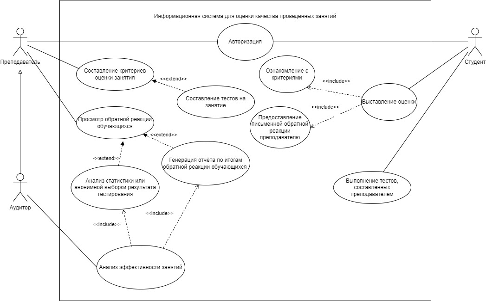
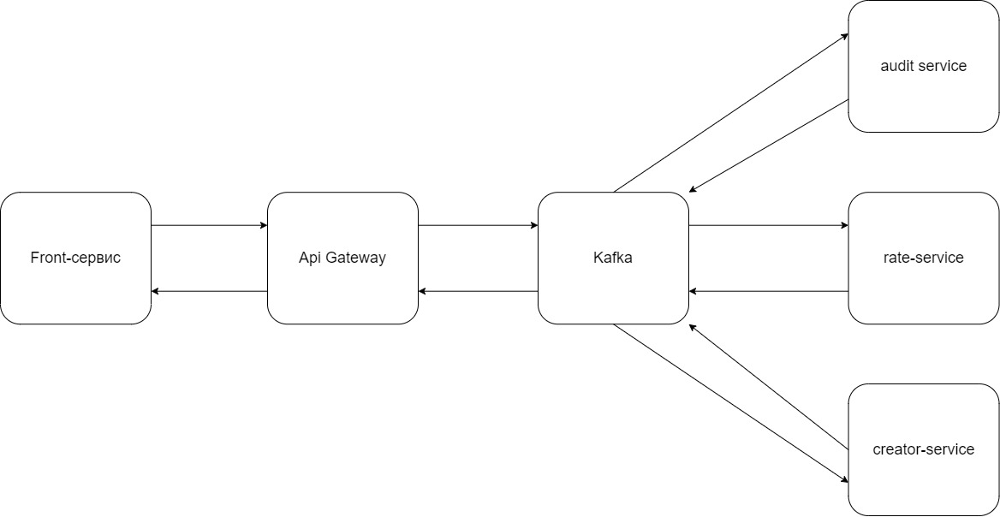

# rate-please-stankin
Система оценки качества проведённых занятий. Проект по дипломной работе.

Описание процесса как я его вижу. Студент:
    1. Студент проходит авторизацию и аутентификацию (Номер студенческого билета, пароль)
    2. У студента изначально определены Курс и список занятий.
    3. У студента отображены следующие страницы:
        3.1 Расписание
        3.2 Окно с прошедшими за сутки занятиями с возможностью оставить оценку.
        3.3 Окно с доступными тестами
        3.4 Список дел на семестр

Описание процесса как я его вижу. Преподаватель:
    1. Преподаватель проходит авторизацию и аутентификацию(ПУЗ преподавателя, пароль)
    2. У преподавателя изначально определены группы которые он ведёт.
    3. У преподавателя отображены следующие страницы:
        3.1 Расписание
            3.1.1 На каждом занятии есть возможность создать тест или добавить критерий оценивания
        3.2 Расписание с возможностью посмотреть обратные реакции и оценки 
        3.3 (Аналитика) Генерация агрегатов статистика прохождения тестирования и (или) обратной реакции  
        3.4 Раздел с фиксацией задания на семестр по каждому предмету

Описание процесса как я его вижу. Аудитор:
    1. Аудитор логинится (ПУЗ преподавателя, пароль)
    2. У Аудитора свой UI с возможностью выбора агрегатов через преподавателя или отдельную группу

Описание струтур данных и технологий как я это вижу.
    1. Для хранения json-документов и быстрого поиска необходимого стоит попробовать MongoDB.
        В качестве JSON будут храниться представления. В качестве представлений react будет считывать следующие вью:
            1.1 Строгие оценки по критериям. Надо продумать шкалу. Надо продумать критерии.
            1.2 Тесты. Тесты могут быть с картинками, со множеством вариантов ответов, или текстовым вариантом.
    2. В качестве фронта будет выступать React.js с React-router v6. Раскопать как генерировать страницы.
    3. В качестве бека - Java Sring Boot приложение. Пока что монолит, в случае чего - можно будет распилить.
        Бэкенд будет:
        1. Высылать расписание.
        2. Обрабатывать запросы на оценку тестирование, составление тестов, составление критериев, 
            обработку обратной реакции в текстовом виде и в виде фиксированных оценок.
        3. Генерация агрегатов.
Роли:
    Предусмотренно три роли: Преподаватель, студент и аудитор
    [Диаграмма прецедентов решения.drawio](%C4%E8%E0%E3%F0%E0%EC%EC%E0%20%EF%F0%E5%F6%E5%E4%E5%ED%F2%EE%E2%20%F0%E5%F8%E5%ED%E8%FF.drawio)  
    
    [Архитектура решения.drawio](%C0%F0%F5%E8%F2%E5%EA%F2%F3%F0%E0%20%F0%E5%F8%E5%ED%E8%FF.drawio)  
    